# Polyphony Task Breakdown

This directory breaks the "Web complete version" of Polyphony into 60 implementable, verifiable steps (`step1.md` ... `step60.md`). The goal is to deliver everything in `phases.md` Phases 2-20 — WebSocket realtime, invitations and member management, the full 5-tier RBAC model, AI context control and token estimation, the Anthropic and Gemini providers with model selection, gRPC, the Ory Kratos auth migration, Redis pub/sub and rate limiting, image upload with Vision (MinIO as local S3), groups, private AI mode, OAuth social login via Kratos + Hydra, token balances, Stripe billing in test mode, context summarization, streaming AI responses, and room fork — all runnable and verifiable locally with Docker Compose. AWS/Terraform/CI-CD deployment and monitoring (Phases 21-23) and the Flutter mobile app (Phases 24-25) are explicitly out of scope.

The breakdown follows a small set of working decisions agreed with the user. It is **refactor-first**: each component's wave-1 and wave-2 steps establish a clean architectural foundation (DI wiring, event-driven messaging, hexagonal reshaping, BFF auth, test harnesses) before feature steps build on top of it. **Bold architecture changes are approved** where best practice demands them — server components, React Query, and httpOnly-cookie auth replace the original client-side/localStorage web design; the Go server's `main.go` is decomposed into a DI container; the Rust gateway's domain and ports are reshaped once, up front, so later providers and streaming land in disjoint files. Every step is sized as **one PR, implementable and verifiable by a single AI agent in a few hours**, and the full set is designed as a **parallel-friendly DAG**: dependencies are minimized and waves are wide rather than forming one long linear chain.

To use this breakdown: pick any step whose `Depends on` column lists only steps that are already done, read that step's file for its full scope and verification checklist, implement it as one PR, and check off its checklist items as you go. Steps in the same wave have no dependency relationship between them and are safe to implement in parallel by different agents. The wave numbers below are derived from the dependency graph (`wave = 1 + max(dependency wave)`) and are purely descriptive — the real scheduling contract is the `Depends on` column and the DAG in this document, not the wave grouping.

## Target Architecture

These architectural targets are committed in waves 1-2 and assumed by every later step:

- **Server (Go)**: `cmd/api/main.go` split into an `internal/app` DI container plus per-handler route registrars, so later steps only append small files. Message pipeline is event-driven via `domain/event.MessageHub` (`InProcessHub`, swapped for `RedisHub` in step 31) with per-user targeted delivery designed in from day one. A typed 5-tier `room.Role` enum backed by a single RBAC middleware (merging Phases 4 and 11 into step 13). Model resolution follows request > `room.ai_model` > global default. `slog` everywhere with request-id propagation. `LLMGateway` interface with REST and gRPC implementations selectable behind an env flag.
- **Gateway (Rust)**: Hexagonal layout retained (domain/ports/adapters). `thiserror` `DomainError` with `#[source]` chains plus a `RateLimited` variant. `MessageContent` enum (`Text` | `Parts`) enabling Vision from the start. Async `models()`. `CompletionChunk` and `stream()` ports land in step 3, before providers multiply. Each provider is split into `request.rs` (mapping) and `stream.rs` (streaming) submodules so Vision plumbing (step 39) and SSE streaming (step 43) can edit disjoint files in the same wave. Per-adapter explicit config including base-URL overrides (enables the E2E LLM stub). REST and gRPC (tonic) coexist.
- **Web (Next.js)**: Bulletproof React layout and Chakra UI v3 retained. TanStack Query with RSC prefetch/`HydrationBoundary`. Per-feature `api`/`types` modules replace the monolithic `api.ts`/`types.ts`. MSW (authored in step 5, migrated per-feature in step 9) replaces `MockApiClient`. The TanStack Query cache is the single merge point for both WebSocket events and streaming chunks.
- **Auth data-plane sequencing (explicit, no dead zones)**: Step 4 introduces httpOnly-cookie BFF auth and a catch-all proxy (`app/api/proxy/[...path]`) that reads the cookie and forwards all data calls to the Go API with a Bearer header, so the app stays fully functional between steps 4 and 9. SimpleJWT remains the Docker Compose default through wave 3 (step 20 lands `KratosAuthService` behind an env flag only). Step 30 flips the default to Kratos, switches the BFF proxy to forwarding the Kratos session cookie, and removes Bearer forwarding and the JWT route handlers. Step 15's WebSocket ticket is a short-lived server-signed token issued by an authenticated endpoint, independent of the `AuthService` implementation, so it survives the auth swap unchanged.
- **OAuth**: Phase 15 is delivered in full — Kratos brokers social login (step 44) against a local dex mock OIDC provider (real Google/GitHub optional via `.env` keys), and Ory Hydra ships as a full OAuth2/OIDC provider with Kratos-backed login/consent and a demo first-party client (step 55), running in parallel with disjoint files.
- **E2E strategy**: Step 10 lands the Playwright harness including a canned OpenAI-compatible LLM stub (static completions plus SSE fixtures) in the Docker Compose test profile — the single stub every AI/streaming/Vision spec assumes, so no later step improvises provider stubbing. Regression is split into four area suites with disjoint spec files and fix mandates bounded to their own failures (steps 56-59), followed by a thin final gate (step 60) that makes the full clean-`docker compose up` run green and carries the documentation sync.

## Wave Table

**Wave 1**

| Step | Title | Type | Components | Depends on |
|---|---|---|---|---|
| [step1](step1.md) | Go server foundation: DI/router split, structured logging, lint, config | refactor | server, infra | — |
| [step2](step2.md) | Go test infrastructure: testcontainers helper + shared mocks | testing | server | — |
| [step3](step3.md) | Rust gateway domain/ports reshape (streaming+multimodal-ready) | refactor | llm-gateway | — |
| [step4](step4.md) | Web BFF auth + data-plane proxy: httpOnly cookies, middleware guard, typed HTTP client | refactor | web | — |
| [step5](step5.md) | Web vitest + RTL unit-test harness + MSW mock layer | testing | web | — |
| [step6](step6.md) | Infra tooling baseline: compose healthchecks, Taskfile, env staging, migration convention | infra | infra, docs | — |

**Wave 2**

| Step | Title | Type | Components | Depends on |
|---|---|---|---|---|
| [step7](step7.md) | Go event-driven messaging core: MessageHub, atomic sequences, response linkage | refactor | server | [step1](step1.md), [step2](step2.md) |
| [step8](step8.md) | Rust gateway operational hardening | refactor | llm-gateway | [step3](step3.md) |
| [step9](step9.md) | Web data layer migration: TanStack Query, RSC prefetch, per-feature API modules | refactor | web | [step1](step1.md), [step4](step4.md), [step5](step5.md) |
| [step10](step10.md) | Playwright E2E harness + seeded compose test stack + LLM stub | testing | web, infra | [step4](step4.md), [step6](step6.md) |
| [step11](step11.md) | Infra: Ory Kratos services in docker-compose | infra | infra | [step6](step6.md) |

**Wave 3**

| Step | Title | Type | Components | Depends on |
|---|---|---|---|---|
| [step12](step12.md) | Server: MinIO object storage + attachments + presigned upload endpoints | feature | server, infra | [step1](step1.md), [step2](step2.md), [step6](step6.md), [step7](step7.md) |
| [step13](step13.md) | Go 5-tier RBAC domain + authorization middleware + ModelUsecase | refactor | server | [step2](step2.md), [step7](step7.md) |
| [step14](step14.md) | Rust gateway test harness: router oneshot + wiremock provider tests | testing | llm-gateway | [step3](step3.md), [step8](step8.md) |
| [step15](step15.md) | Server WebSocket endpoint + realtime delivery | feature | server | [step7](step7.md) |
| [step16](step16.md) | Web persistent sidebar chat layout | ui | web | [step9](step9.md) |
| [step17](step17.md) | Web forms, toaster, and App Router error surfaces | ui | web | [step9](step9.md) |
| [step18](step18.md) | Web message list rendering upgrade + ChatRoom decomposition | ui | web | [step9](step9.md) |
| [step19](step19.md) | gRPC contract: proto definitions + Rust tonic inbound adapter | feature | llm-gateway, server | [step3](step3.md), [step8](step8.md) |
| [step20](step20.md) | Server: Kratos session auth swap + identity migration | feature | server | [step1](step1.md), [step2](step2.md), [step11](step11.md) |

**Wave 4**

| Step | Title | Type | Components | Depends on |
|---|---|---|---|---|
| [step21](step21.md) | Server: room invitations | feature | server | [step13](step13.md) |
| [step22](step22.md) | Server: member management, leave, role change, ownership transfer | feature | server | [step13](step13.md) |
| [step23](step23.md) | Server: AI context control (soft delete, exclude flag, cutoff, context builder) | feature | server | [step13](step13.md) |
| [step25](step25.md) | Rust: Anthropic provider adapter | feature | llm-gateway | [step8](step8.md), [step14](step14.md) |
| [step26](step26.md) | Rust: Gemini provider adapter | feature | llm-gateway | [step8](step8.md), [step14](step14.md) |
| [step27](step27.md) | Token estimation endpoint (gateway) + Go proxy | feature | llm-gateway, server | [step1](step1.md), [step14](step14.md) |
| [step28](step28.md) | Go: gRPC LLM client swap + retry + health | feature | server | [step1](step1.md), [step19](step19.md) |
| [step29](step29.md) | Web send pipeline UX: optimistic send, AI thinking, retry, infinite scroll | ui | web | [step18](step18.md) |
| [step30](step30.md) | Web: Kratos-driven login/registration + auth data-plane flip | feature | web | [step10](step10.md), [step17](step17.md), [step20](step20.md) |
| [step31](step31.md) | Redis in compose + RedisHub MessageHub swap | feature | server, infra | [step6](step6.md), [step15](step15.md) |
| [step42](step42.md) | Server: token balance management | feature | server | [step7](step7.md), [step13](step13.md) |

**Wave 5**

| Step | Title | Type | Components | Depends on |
|---|---|---|---|---|
| [step24](step24.md) | Server: per-room AI provider/model settings | feature | server | [step13](step13.md), [step23](step23.md) |
| [step33](step33.md) | Server: Redis rate limiting + Kratos session cache | feature | server | [step20](step20.md), [step31](step31.md) |
| [step34](step34.md) | Model metadata (token limits + pricing) across gateway/server/web | feature | llm-gateway, server, web | [step9](step9.md), [step25](step25.md), [step26](step26.md), [step28](step28.md) |
| [step35](step35.md) | Web WebSocket client + live cache merge | feature | web | [step15](step15.md), [step29](step29.md) |
| [step37](step37.md) | Web members, invitations, and roles UI | ui | web | [step10](step10.md), [step16](step16.md), [step21](step21.md), [step22](step22.md) |
| [step38](step38.md) | Web AI context UI: exclude toggle, delete, token meter | ui | web | [step10](step10.md), [step23](step23.md), [step27](step27.md), [step29](step29.md) |
| [step39](step39.md) | Vision multimodal plumbing: gateway content-parts mapping + Go DTOs | feature | llm-gateway, server | [step12](step12.md), [step25](step25.md), [step26](step26.md) |
| [step40](step40.md) | Server: groups + batch invitations | feature | server | [step21](step21.md) |
| [step41](step41.md) | Server: private AI mode | feature | server | [step15](step15.md), [step23](step23.md) |
| [step43](step43.md) | Rust: streaming SSE for all providers + stream endpoint | feature | llm-gateway | [step14](step14.md), [step25](step25.md), [step26](step26.md) |
| [step44](step44.md) | OAuth social login via Kratos OIDC (dex mock + Google/GitHub) | feature | web, infra | [step10](step10.md), [step11](step11.md), [step30](step30.md) |
| [step48](step48.md) | Web: token balance + usage history UI | ui | web | [step10](step10.md), [step16](step16.md), [step42](step42.md) |
| [step49](step49.md) | Server: Stripe billing (test mode) + subscription lifecycle | feature | server, infra | [step42](step42.md) |
| [step55](step55.md) | Ory Hydra OAuth2/OIDC provider + first-party client demo | feature | infra, web | [step11](step11.md), [step30](step30.md) |

**Wave 6**

| Step | Title | Type | Components | Depends on |
|---|---|---|---|---|
| [step32](step32.md) | Server: room fork (async batch copy) | feature | server | [step7](step7.md), [step13](step13.md), [step24](step24.md) |
| [step36](step36.md) | Web room settings drawer | ui | web | [step16](step16.md), [step24](step24.md), [step34](step34.md) |
| [step45](step45.md) | Web: image upload + attachment UI + Vision send | ui | web | [step10](step10.md), [step29](step29.md), [step39](step39.md) |
| [step46](step46.md) | Web: group management UI | ui | web | [step37](step37.md), [step40](step40.md) |
| [step50](step50.md) | Server: context summarization with cached summaries | feature | server, web | [step23](step23.md), [step27](step27.md), [step34](step34.md), [step41](step41.md) |
| [step51](step51.md) | Go: consume gateway stream + WS chunk forwarding | feature | server | [step15](step15.md), [step23](step23.md), [step42](step42.md), [step43](step43.md) |
| [step53](step53.md) | Web: plans, Stripe Checkout, subscription management, billing history UI | ui | web | [step10](step10.md), [step17](step17.md), [step49](step49.md) |

**Wave 7**

| Step | Title | Type | Components | Depends on |
|---|---|---|---|---|
| [step47](step47.md) | Web: private AI mode UI | ui | web | [step10](step10.md), [step35](step35.md), [step41](step41.md), [step45](step45.md) |
| [step52](step52.md) | Web: room fork UI | ui | web | [step10](step10.md), [step32](step32.md), [step36](step36.md) |
| [step54](step54.md) | Web: streaming AI rendering | ui | web | [step10](step10.md), [step35](step35.md), [step51](step51.md) |
| [step56](step56.md) | E2E regression: auth, OAuth/Hydra, rooms, members, invitations, groups | testing | web, infra | [step10](step10.md), [step30](step30.md), [step37](step37.md), [step44](step44.md), [step46](step46.md), [step55](step55.md) |
| [step57](step57.md) | E2E regression: realtime AI core — send, model select, context controls, rate limiting | testing | web, infra | [step10](step10.md), [step31](step31.md), [step33](step33.md), [step34](step34.md), [step35](step35.md), [step36](step36.md), [step38](step38.md) |

**Wave 8**

| Step | Title | Type | Components | Depends on |
|---|---|---|---|---|
| [step58](step58.md) | E2E regression: summarization, streaming, private mode, images/Vision | testing | web, infra | [step10](step10.md), [step45](step45.md), [step47](step47.md), [step50](step50.md), [step54](step54.md) |
| [step59](step59.md) | E2E regression: billing and room fork | testing | web, infra | [step10](step10.md), [step48](step48.md), [step52](step52.md), [step53](step53.md) |

**Wave 9**

| Step | Title | Type | Components | Depends on |
|---|---|---|---|---|
| [step60](step60.md) | Final E2E gate + docs/progress sync | testing | web, infra, docs, server, llm-gateway | [step56](step56.md), [step57](step57.md), [step58](step58.md), [step59](step59.md) |

## Dependency Graph

```mermaid
flowchart TD
    subgraph W1["Wave 1"]
        S1["S1"]
        S2["S2"]
        S3["S3"]
        S4["S4"]
        S5["S5"]
        S6["S6"]
    end
    subgraph W2["Wave 2"]
        S7["S7"]
        S8["S8"]
        S9["S9"]
        S10["S10"]
        S11["S11"]
    end
    subgraph W3["Wave 3"]
        S12["S12"]
        S13["S13"]
        S14["S14"]
        S15["S15"]
        S16["S16"]
        S17["S17"]
        S18["S18"]
        S19["S19"]
        S20["S20"]
    end
    subgraph W4["Wave 4"]
        S21["S21"]
        S22["S22"]
        S23["S23"]
        S25["S25"]
        S26["S26"]
        S27["S27"]
        S28["S28"]
        S29["S29"]
        S30["S30"]
        S31["S31"]
        S42["S42"]
    end
    subgraph W5["Wave 5"]
        S24["S24"]
        S33["S33"]
        S34["S34"]
        S35["S35"]
        S37["S37"]
        S38["S38"]
        S39["S39"]
        S40["S40"]
        S41["S41"]
        S43["S43"]
        S44["S44"]
        S48["S48"]
        S49["S49"]
        S55["S55"]
    end
    subgraph W6["Wave 6"]
        S32["S32"]
        S36["S36"]
        S45["S45"]
        S46["S46"]
        S50["S50"]
        S51["S51"]
        S53["S53"]
    end
    subgraph W7["Wave 7"]
        S47["S47"]
        S52["S52"]
        S54["S54"]
        S56["S56"]
        S57["S57"]
    end
    subgraph W8["Wave 8"]
        S58["S58"]
        S59["S59"]
    end
    subgraph W9["Wave 9"]
        S60["S60"]
    end
    S1 --> S7
    S2 --> S7
    S3 --> S8
    S1 --> S9
    S4 --> S9
    S5 --> S9
    S4 --> S10
    S6 --> S10
    S6 --> S11
    S1 --> S12
    S2 --> S12
    S6 --> S12
    S7 --> S12
    S2 --> S13
    S7 --> S13
    S3 --> S14
    S8 --> S14
    S7 --> S15
    S9 --> S16
    S9 --> S17
    S9 --> S18
    S3 --> S19
    S8 --> S19
    S1 --> S20
    S2 --> S20
    S11 --> S20
    S13 --> S21
    S13 --> S22
    S13 --> S23
    S13 --> S24
    S23 --> S24
    S8 --> S25
    S14 --> S25
    S8 --> S26
    S14 --> S26
    S1 --> S27
    S14 --> S27
    S1 --> S28
    S19 --> S28
    S18 --> S29
    S10 --> S30
    S17 --> S30
    S20 --> S30
    S6 --> S31
    S15 --> S31
    S7 --> S32
    S13 --> S32
    S24 --> S32
    S20 --> S33
    S31 --> S33
    S9 --> S34
    S25 --> S34
    S26 --> S34
    S28 --> S34
    S15 --> S35
    S29 --> S35
    S16 --> S36
    S24 --> S36
    S34 --> S36
    S10 --> S37
    S16 --> S37
    S21 --> S37
    S22 --> S37
    S10 --> S38
    S23 --> S38
    S27 --> S38
    S29 --> S38
    S12 --> S39
    S25 --> S39
    S26 --> S39
    S21 --> S40
    S15 --> S41
    S23 --> S41
    S7 --> S42
    S13 --> S42
    S14 --> S43
    S25 --> S43
    S26 --> S43
    S10 --> S44
    S11 --> S44
    S30 --> S44
    S10 --> S45
    S29 --> S45
    S39 --> S45
    S37 --> S46
    S40 --> S46
    S10 --> S47
    S35 --> S47
    S41 --> S47
    S45 --> S47
    S10 --> S48
    S16 --> S48
    S42 --> S48
    S42 --> S49
    S23 --> S50
    S27 --> S50
    S34 --> S50
    S41 --> S50
    S15 --> S51
    S23 --> S51
    S42 --> S51
    S43 --> S51
    S10 --> S52
    S32 --> S52
    S36 --> S52
    S10 --> S53
    S17 --> S53
    S49 --> S53
    S10 --> S54
    S35 --> S54
    S51 --> S54
    S11 --> S55
    S30 --> S55
    S10 --> S56
    S30 --> S56
    S37 --> S56
    S44 --> S56
    S46 --> S56
    S55 --> S56
    S10 --> S57
    S31 --> S57
    S33 --> S57
    S34 --> S57
    S35 --> S57
    S36 --> S57
    S38 --> S57
    S10 --> S58
    S45 --> S58
    S47 --> S58
    S50 --> S58
    S54 --> S58
    S10 --> S59
    S48 --> S59
    S52 --> S59
    S53 --> S59
    S56 --> S60
    S57 --> S60
    S58 --> S60
    S59 --> S60
```

## Conventions

- **Schema and migration conflicts**: `schema.sql` is Atlas-managed with one migration per PR and a descriptive migration name. Edits to `schema.sql` are additive, and each step touches only the tables it owns; two steps in the same wave never edit the same table (this is enforced via merge-order dependency edges, e.g. `12->7`, `24->23`, `32->24`). If `atlas.sum` conflicts after a rebase, resolve it mechanically with `task migrate:generate` followed by `atlas migrate hash`; `migrate:generate` is explicit/opt-in, never automatic.
- **Definition of done**: a step is complete when the Verification section of its step file passes — this includes the specified unit tests, testcontainers/wiremock/router tests, and any Playwright specs the step introduces, run against a local Docker Compose stack.
- **Checklists**: each step file contains a scope checklist. Check off items with `[x]` as they are completed during implementation, and confirm every item is checked before considering the step done, per the project's `.ai_progress` convention.
- **Hot files / same-wave ownership**: `docker-compose.yml` and `Taskfile.yml` edits are additive, alphabetized service blocks (steps 6, 10, 11, 12, 31, 44, 49, 55). Rust `main.rs` provider DI registrations are one additive line per provider (25, 26). Web `MessageList`/`MessageInput` ownership rotates per wave (18 -> 29 -> 38 -> 45 -> 47/54). Where a `conflictNotes` field in a step file calls out a merge-order-only dependency, treat it as a scheduling constraint, not a functional prerequisite.

## Critical Path

The longest dependency chain through the plan is:

1. [step1](step1.md) — Go server foundation: DI/router split, structured logging, lint, config
2. [step7](step7.md) — Go event-driven messaging core: MessageHub, atomic sequences, response linkage
3. [step13](step13.md) — Go 5-tier RBAC domain + authorization middleware + ModelUsecase
4. [step23](step23.md) — Server: AI context control (soft delete, exclude flag, cutoff, context builder)
5. [step24](step24.md) — Server: per-room AI provider/model settings
6. [step32](step32.md) — Server: room fork (async batch copy)
7. [step52](step52.md) — Web: room fork UI
8. [step59](step59.md) — E2E regression: billing and room fork
9. [step60](step60.md) — Final E2E gate + docs/progress sync

Every other step branches off this backbone; the wave table and dependency graph above show the full parallel structure around it.
